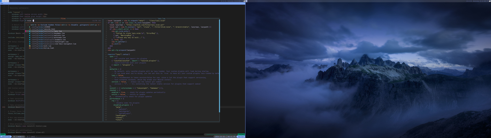

# dotfiles

[~~Turns out light mode is better for the eyes
🤯~~](https://www.allaboutvision.com/digital-eye-strain/is-dark-mode-better-for-eyes/)

My eyes have never been strained when using dark mode, and darker themes not
only look better but are often more widely available.

[](setup.png)

Window manager: [Sway](https://github.com/swaywm/sway)  
Terminal: [WezTerm](https://github.com/wez/wezterm)  
Shell: [Zsh](https://www.zsh.org/) + [Oh My Zsh!](https://ohmyz.sh/)  
Editor: [NeoVim](https://github.com/neovim/neovim)  
Terminal multiplexer: [tmux](https://github.com/tmux/tmux)

## Setup

[Sway](https://github.com/swaywm/sway) is a tilling Wayland compositor that can
be easily managed using only keyboard. Using it instead of desktop environment
has an advantage of not having mental overload of using `ALT+TAB` and mouse.

[WezTerm](https://github.com/wez/wezterm) is a GPU-accelerated terminal that
has great documentation and is configurable using Lua.

[Zsh](https://www.zsh.org/) shell used together with [Oh My
Zsh!](https://ohmyz.sh/) has various quality of life improvements over
[bash](https://www.gnu.org/software/bash/) and in contrary to
[fish](https://fishshell.com/) is highly POSIX complaint.

[NeoVim](https://github.com/neovim/neovim) is a fast and highly extensible
editor built on top of VIM. It's a definitely fun editor to use when you get a
hang of it.

[tmux](https://github.com/tmux/tmux) is a terminal multiplexer. Personally I
use it mainly for the following:

- session - previously I had to open multiple VSC editors for each project. Now
  switching between projects while using with `tmux-sessionizer` is a blast,
- windows and panes - new windows and panes under single shortcut,
- `tmux-continuum` and `tmux-resurrect` - all progress is saved and restored
  automatically.

## Installation commands

### Ubuntu

```bash
sudo apt update -y
sudo apt install sway grim wofi ripgrep fd-find tmux wdisplays \
  xdg-desktop-portal-wlr zsh dunst git unzip make gcc jq ffmpegthumbnailer unar \
  zoxide poppler-utils slurp wl-clipboard libfuse2 curl nodejs npm gimp stow tldr
```

This leaves following to install:

- [Neovim](https://neovim.io/) - AppImage
- [WezTerm terminal](https://wezfurlong.org/wezterm/) - AppImage
- [Obsidian](https://obsidian.md/) - Snap
- [Oh My Zsh! framework](https://ohmyz.sh/) - install with specified path to
  configuration folder `ZSH=~/.config/oh-my-zsh sh install.sh`
- [Tmux Plugin Manager](https://github.com/tmux-plugins/tpm) - `<prefix-I>` to
  install plugins
- [fzf](https://junegunn.github.io/fzf/) - get latest binary
- [NerdFonts](https://github.com/ryanoasis/nerd-fonts) - download font package,
  extract it to `/usr/local/share/fonts`, `fc-cache` to refresh, `fc-list | grep
  <font>` to verify
- [Yazi terminal file manager](https://github.com/sxyazi/yazi) - binary file
- [Rust](https://www.rust-lang.org) - default
- [Go](https://go.dev/) - default
- [zsh-autosuggestions](https://github.com/zsh-users/zsh-autosuggestions/) and
  [zsh-syntax-highlighting](https://github.com/zsh-users/zsh-syntax-highlighting) -
  `git clone` to `~/.oh-my-zsh/custom/plugins`
- [LazyGit](https://github.com/jesseduffield/lazygit) - download tar and follow
  default instructions
- [WebCord](https://github.com/SpacingBat3/WebCord) - Snap
