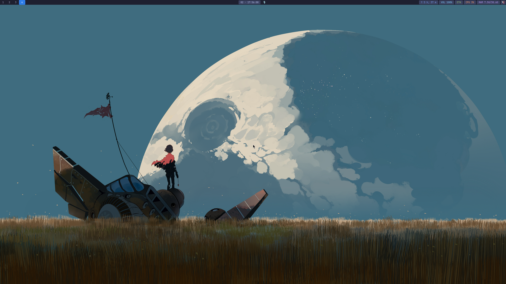

# dotfiles

[](setup.png)

Window manager: [Sway](https://github.com/swaywm/sway)  
Terminal: [WezTerm](https://github.com/wez/wezterm)  
Shell: [Zsh](https://www.zsh.org/) + [Oh My Zsh!](https://ohmyz.sh/)  
Editors: [NeoVim](https://github.com/neovim/neovim) and [Visual Studio Code](https://code.visualstudio.com/)
Terminal multiplexer: [herdr](https://herdr.dev)

## Setup

[Sway](https://github.com/swaywm/sway) is a tilling Wayland compositor that can
be easily managed using only keyboard. Using it instead of desktop environment
has an advantage of not having mental overload of using `ALT+TAB` and mouse.

[WezTerm](https://github.com/wez/wezterm) is a GPU-accelerated terminal that
has great documentation and is configurable using Lua.

[Zsh](https://www.zsh.org/) shell used together with [Oh My
Zsh!](https://ohmyz.sh/) has various quality of life improvements over
[bash](https://www.gnu.org/software/bash/) and in contrary to
[fish](https://fishshell.com/) is highly POSIX complaint.

[NeoVim](https://github.com/neovim/neovim) is a fast and highly extensible
editor built on top of VIM. It's a definitely fun editor to use when you get a
hang of it.

[Visual Studio Code](https://code.visualstudio.com/) as much as I'd like to rely
only on NeoVim, some tasks are much more easier to be done using VSC. In my case
it is configured to be similar to [NeoVim](https://github.com/neovim/neovim).

[herdr](https://herdr.dev) is a replacement for tmux - it has more things working
out of the box and allows tracking agentic sessions.

## Installation commands

### Ubuntu

```bash
sudo apt update -y
sudo apt install sway swaylock swayidle grim wofi ripgrep fd-find wdisplays \
  xdg-desktop-portal-wlr zsh dunst git unzip make gcc jq \
  slurp wl-clipboard wtype cliphist libfuse2 curl nodejs npm \
  gimp stow pavucontrol guvcview
```

This leaves following to install:

- [Neovim](https://neovim.io/) - AppImage
- [Visual Studio Code](https://code.visualstudio.com/) - `.deb` package`
- [WezTerm terminal](https://wezfurlong.org/wezterm/) - AppImage
- [Obsidian](https://obsidian.md/) - Snap
- [Oh My Zsh! framework](https://ohmyz.sh/) - install with specified path to
  configuration folder `ZSH=~/.config/oh-my-zsh sh install.sh`
- [herdr](https://herdr.dev) - default
- [fzf](https://junegunn.github.io/fzf/) - get latest binary
- [NerdFonts](https://github.com/ryanoasis/nerd-fonts) - download font package,
  extract it to `/usr/local/share/fonts`, `fc-cache` to refresh, `fc-list | grep
  <font>` to verify
- [Rust](https://www.rust-lang.org) - default
- [Go](https://go.dev/) - default
- [zsh-autosuggestions](https://github.com/zsh-users/zsh-autosuggestions/) and
  [zsh-syntax-highlighting](https://github.com/zsh-users/zsh-syntax-highlighting) -
  `git clone` to `~/.oh-my-zsh/custom/plugins`
- [LazyGit](https://github.com/jesseduffield/lazygit) - download tar and follow
  default instructions
- [vesktop](https://github.com/Vencord/Vesktop) - `.deb` package
- [Voxtype](https://github.com/peteonrails/voxtype) - `.deb` package
- [Bitwarden](https://bitwarden.com/) - Snap
